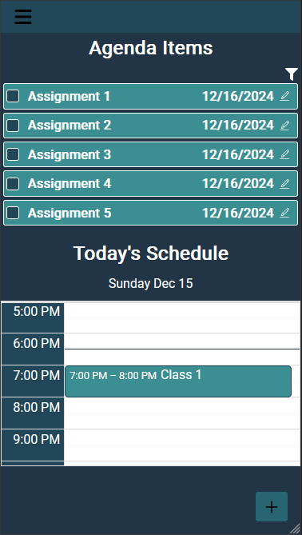
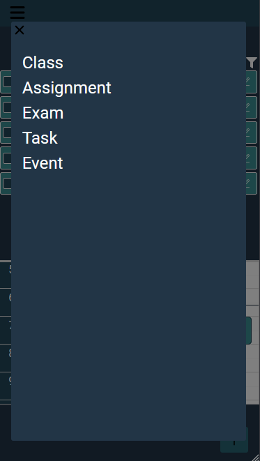
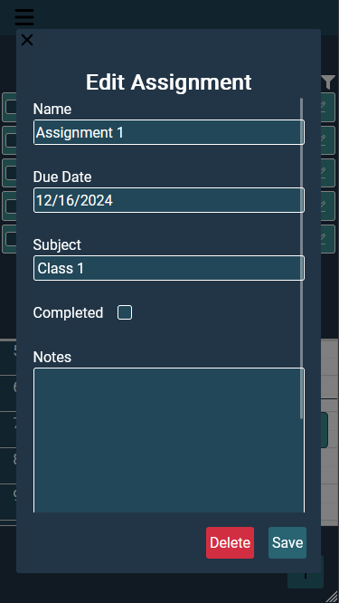
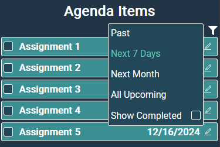
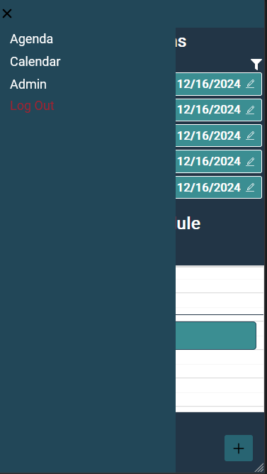
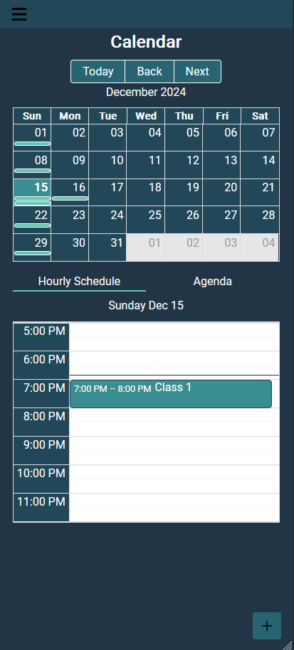
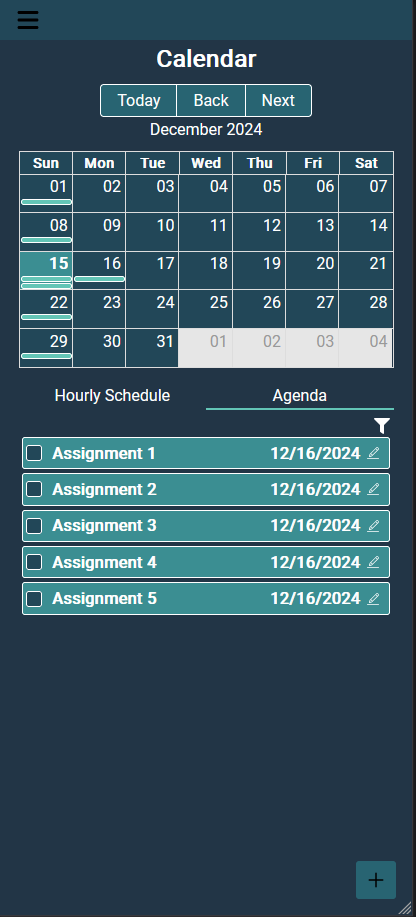
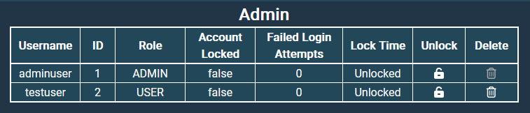

# Student Planner

Student Planner is a web application that helps students manage their schedules. It is inspired by the _School Planner_
Android application by Andrea Dal Cin, which can be found on
the [Google Play Store](https://play.google.com/store/apps/details?id=daldev.android.gradehelper&pcampaignid=web_share).

### Features

- **Agenda Management**: Keep track of assignments and other tasks. Set due dates, see which assignments are coming due,
  and check tasks off once they are completed.
- **Class Schedule**: Create a weekly class schedule. Keep track of the day, time, and location of recurring classes as
  well as one-off events or exams. View your hour-by-hour schedule for the day.
- **Calendar**: See at a glance what days of the month have scheduled events or agenda items. Click on a day on the
  calendar to see an hour-by-hour schedule or a list of upcoming assignments on that day.

## Installation

This app runs entirely in docker containers for production
mode. See the [docker docs](https://docs.docker.com/engine/install/) for installation instructions.

```bash
$ docker --version
Docker version 26.0.0, build 2ae903e

$ docker compose version
Docker Compose version v2.26.1-desktop.1
```

Node.js is required to run the app in development mode. Download Node.js [here](https://nodejs.org/en/download/).
Installing Node.js natively is not necessary for production mode.

```bash
$ node -v
v20.17.0

$ npm -v
10.8.2

$ cd student-planner-frontend
$ npm i
```

This project uses just to conveniently save and run build and startup commands. See the installation instructions on
the [just GitHub page](https://github.com/casey/just). Instructions to start the app without just are documented as
well.

```bash
$ just --version
just 1.36.0
```

## Getting Started

### Set Up Environment variables
Add a file called .env to the project directory and set the following environment variables.
```bash
POSTGRES_USER=postgres
POSTGRES_PASSWORD=changeit
PGADMIN_DEFAULT_EMAIL=your@email.com
PGADMIN_DEFAULT_PASSWORD=changeit
ADMIN_USERNAME=adminuser
ADMIN_PASSWORD=changeit
```

### Starting in Development Mode

```bash
# With just
$ just start-dev

# Without just
# Start containers for the database, backend, and pgadmin.
$ docker compose -f dev.yml up --build -d
# Start the frontend
$ cd student-planner-frontend
$ npm i
$ npm run dev
```

### Starting in Production Mode

```bash
# With just
$ just start-prod

# Without just
$ docker compose -f prod.yml up --build -d
```

Once started, the application will be deployed at http://localhost:3000 in development mode or http://localhost:8080 for production mode. Log in with your admin account credentials at /login or create a new, non-admin account at /register.

After logging in, you will be directed to the agenda page. You will see a list of agenda items and an hourly schedule for today.



Click the + icon in the bottom-right corner to add new classes, assignments, exams, tasks, or events. This button is accessible from any page in the application.



Select the checkbox on an item to mark it as complete. Click the pen icon to view more information about an agenda item and edit it. You can also view and edit an event, class, or exam by clicking on its block in the schedule.



Select the funnel icon above the agenda items to pick what range of due dates to display and toggle whether to display completed items.



Clicking on the icon in the upper-left corner will open the navigation bar, which has links to the other pages in the application and a button for logging out.



The calendar page features a monthly calendar. Days with blocks visible have scheduled events, exams, classes, or task or assignment due dates. (These may be difficult to see when zoomed in or at lower resolutions). Clicking on a day brings up the hourly schedule for that day. You can navigate to future or past months or return to today's date with the buttons above the calendar.



Clicking agenda tab will replace the hourly schedule with a list of agenda items due on or near the date you have selected.



The admin page is only accessible if you have logged in with your admin account. It has a table with information about the status of user accounts and whether they have been locked due to failed login attempts. Clicking the button in the "Unlock" column will unlock a user's account and allow them to attempt logging in again. Clicking the button in the "Delete" column will delete a user's account. The delete button is disabled for the account that is currently logged in.

