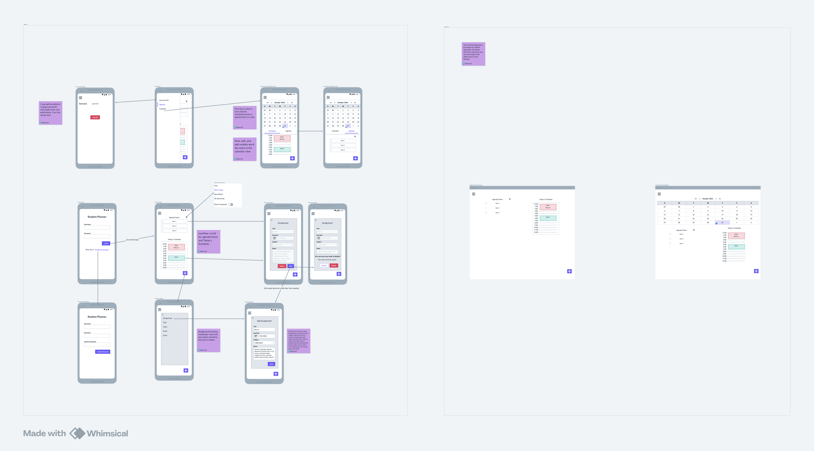
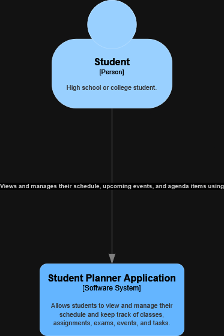
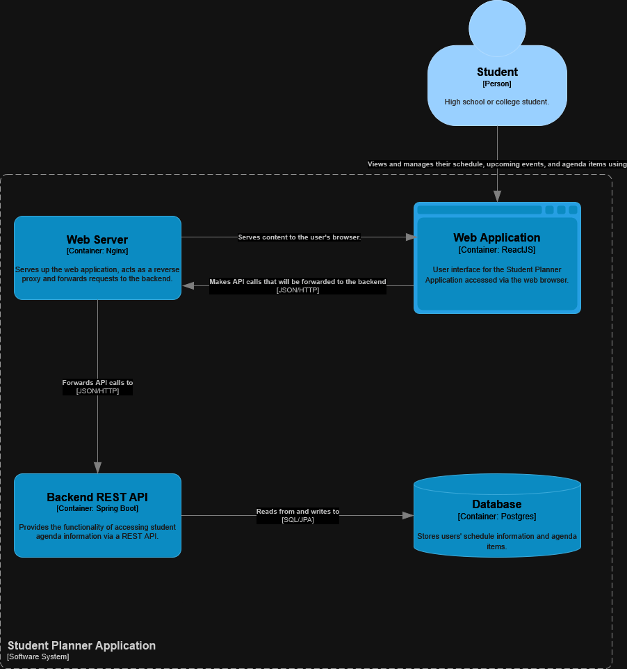
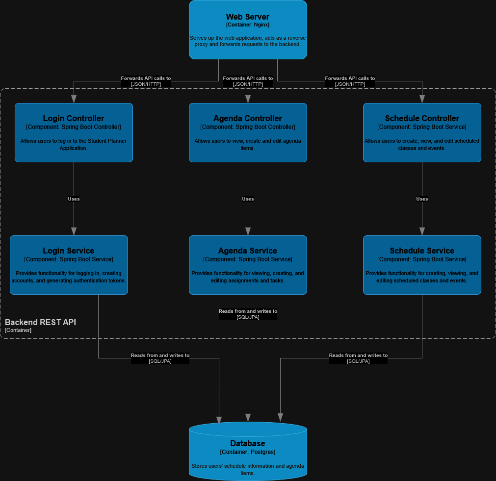

# User Stories

---

As a **student**, I want to **create a list of agenda items**, so I can **keep track of the work that I need to complete
**.

### Acceptance Criteria

- Users can create agenda items with a title and an optional description and class.
- Users can view a list of agenda items.
- Users can mark agenda items as completed.

---

As a **student**, I want to **set a due date on agenda items**, so I can **prioritize work based on how soon it needs to
be
completed**.

### Acceptance Criteria

- Users can set due dates on agenda items.
- Users can view agenda items in the order that they are due.

---

As a **student**, I want to **track the time and location of my classes**, so I can **plan my daily schedule**.

### Acceptance Criteria

- Users can create a list of their classes
- Users can set days and times of day that their classes meet.
- Users can note the location where their classes meet.
- Users can view their hourly class schedule for each day of the week.

---

As a **student**, I want to **track the time and location of upcoming events, such as exams**, so I can **plan my daily
schedule**.

### Acceptance Criteria

- Users can create events.
- Users can set the time and location of events.
- Users can view events on their hourly schedule for each day of the week.

--- 
As a **student**, I want to **see what days on the calendar have classes, events, and due dates for agenda items**, so I
can
**plan my schedule far in advance**.

### Acceptance Criteria

- Users can view a monthly calendar.
- Icons displayed on days on the calendar indicate which days have classes, events, and due dates for agenda items.
- Users can click on a day on the calendar to bring up their hourly schedule and a list of agenda items due on that day.

# Misuser Stories

The ID number of related techniques or mitigations from the MITRE ATT&CK framework are listed in parentheses where
applicable.

As an **attacker**, I want to **access the data of other users**, so I can **acquire sensitive user information**.

### Mitigation Criteria

- Require users to log in and perform authentication via JWT.
- Include user ID as a foreign key on tables. Perform joins on this column so that the data for users other than the one
  who is logged in will not be returned.

---

As an **attacker**, I want to **use cross-site scripting to acquire access tokens stored in local storage, session
storage, or
cookies**, so I can **access another user’s account** (T1189).

### Mitigation Criteria

- Use HttpOnly cookies to store JWTs so they cannot be accessed by javascript.

---

As an **attacker**, I want to **perform SQL injection**, so I can **infiltrate the database** (T1190).

### Mitigation Criteria

- Use libraries on the backend that sanitize user input before it is sent to the database.

---

As an **attacker**, I want to **guess a user’s password via brute force**, so I can **access another user’s account** (
T1110.001)

### Mitigation Criteria

- Set password requirements that follow best practices (M1027).
- Set lockout policies after too many failed login attempts (M1036).

---
As an **unknowing user**, I want to **use a weak password**, so I can **easily remember my password**.

### Mitigation Criteria

- Set password requirements that follow best practices (M1027).
- Properly communicate password requirements to the user in the UI.

---

As an **abusive user**, I want to **use the fields of agenda items and events to store large amounts of data**, so I can
**use the
application for personal cloud storage**.

### Mitigation Criteria

- Set reasonable maximum lengths for fields in the database.
- Perform validation of data lengths on the frontend and the backend.
- Monitor the database to spot excessive usage by a single user.

# Mockup

# C4 Diagrams

## System Context

## Container

### Backend REST API Component

